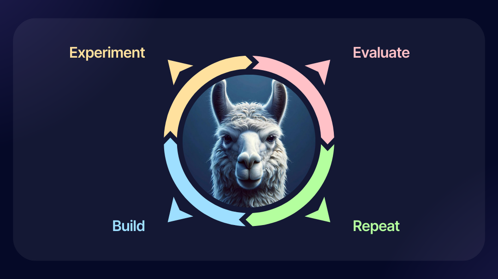

# 📄 Overview

We at AI Planet are excited to introduce [BeyondLLM](https://github.com/aiplanethub/beyondllm), an open-source framework designed to streamline the development of RAG and LLM applications, complete with evaluations, all in just 5-7 lines of code.&#x20;

Yes, you read that correctly. Only 5-7 lines of code.&#x20;

Let's understand what and why one needs BeyondLLM.

<figure><figcaption>
Build-Experiment-Evaluate-Repeat
</figcaption></figure>

### Why BeyondLLM?

#### Easily build RAG and Evals in 5 lines of code

* Building a robust RAG (Retrieval-Augmented Generation) system involves integrating `various components` and managing associated `hyperparameters`. BeyondLLM offers an optimal framework for `quickly experimenting with RAG applications`.&#x20;
* With components like `source` and `auto_retriever`, which support several parameters, most of the integration work is automated, eliminating the need for manual coding.&#x20;
* Additionally, we are actively working on enhancing features such as hyperparameter tuning for RAG applications, addressing the next key aspect of our development roadmap.

#### Customised Evaluation Support

* The evaluation of RAG in the market largely relies on the OpenAI API Key and closed-source LLMs. However, with BeyondLLM, you have the flexibility to select any LLM for evaluating both LLMs and embeddings.&#x20;
* We offer support for `2 evaluation metrics` for embeddings: `Hit rate` and `MRR (Mean Reciprocal Rank)`, allowing users to choose the most suitable model based on their specific needs.
* Additionally, we provide `4 evaluation metrics` for assessing `Large Language Models` across various criteria, in line with current research standards.

#### Various Custom LLMs support tailoring the basic needs

* HuggingFace: Easily accessible for everyone to access Open Source LLMs
* Ollama: Run LLMs locally
* Gemini: (default LLM): Run Multimodal applications
* OpenAI: Powerful chat model LLM with best quality response
* Azure: For 32K large context good response quality support.

#### Reduce LLM Hallucination&#x20;

* Certainly, the primary objective is to minimize or eliminate hallucinations within the RAG framework.&#x20;
* To support this goal, we've developed the `Advanced RAG section`, facilitating rapid experimentation for constructing RAG pipelines with reduced hallucination risks.&#x20;
* BeyondLLM features, including source and auto\_retriever, incorporate functionalities such as `Markdown splitter`, `chunking strategies`, `Re-ranking (Cross encoders and flag embedding)` and `Hybrid Search`, enhancing the reliability of RAG applications.&#x20;
* It's worth noting Andrej Karpathy's insight: "[Hallucination is a LLM's greatest feature and not a bug](http://twitter.com/karpathy/status/1733299213503787018)," underscoring the inherent capabilities of language models.

Done talking, lets build.&#x20;
